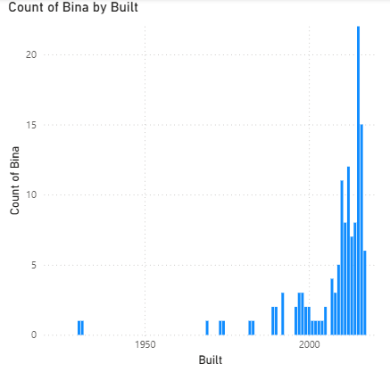
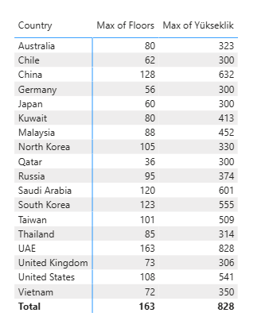

# 🏙️ Power BI – Tallest Buildings Analysis

A data cleaning and visualization project using Power BI, analyzing the world's tallest buildings sourced from Wikipedia.

## 📊 Project Overview

This project demonstrates data cleaning techniques in Power BI's Power Query Editor, followed by two visualizations: a column chart showing construction trends over time, and a matrix showing maximum floors and height per country.

## 🗂️ Dataset

| File | Description |
|------|-------------|
| `Wiki_buildings.xlsx` | 133 tallest buildings with height, floors, country, and year built (Wikipedia) |

## 🛠️ Steps Performed

### 1. Data Import
- Imported `Wiki_buildings.xlsx` into a new Power BI Desktop report

### 2. Data Cleaning (Power Query Editor)
- Split the `Description` column into three new columns: **Building**, **City**, and **Height (m)**
- Removed unwanted text (`meters`, `)`) from the Height column
- Created a custom column: **Average floor height (m)** = Height / Floors

### 3. Visualizations
- **Column Chart:** Number of buildings constructed per year
- **Matrix:** Maximum floors and maximum height per country

## 📈 Key Insights

- **UAE** has the tallest building: Burj Khalifa (828m, 163 floors)
- Construction activity **peaked around 2015**
- **China** leads in total number of tall buildings

## 🖼️ Preview

### Column Chart – Buildings by Year

### Matrix – Max Floors & Height by Country

## 🧰 Tools Used

- Microsoft Power BI Desktop
- Power Query Editor
- Excel (.xlsx)
